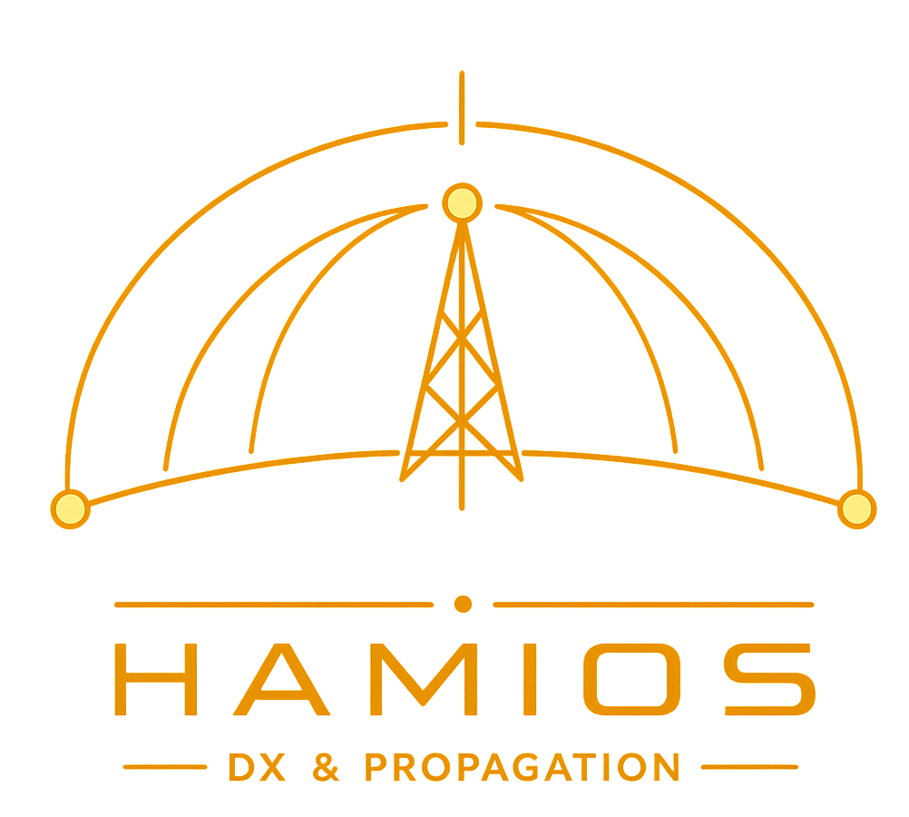

<p align="center">
  
</p>

# HF Voortplanting & Atmosfeer Monitor

**Real-time HF-voortplanting en DX-monitor voor radioamateurs — Windows 10/11**

> v5.4 · Juni 2026 · Frank van Dijke · *Ontwikkeld met Claude AI (Anthropic)*

[](https://hamios.space)
[](https://github.com/fvdijke/HAMIOS/releases/latest)
[](https://github.com/fvdijke/HAMIOS/releases/latest)
[](https://www.python.org)
[](https://github.com/fvdijke/HAMIOS)

---

## Overzicht

HF Voortplanting & Atmosfeer Monitor geeft radioamateurs real-time inzicht in HF-voortplantingscondities, zonne-activiteit, DX-cluster-activiteit, korte-golfschema's, satelliettracking, bliksemdetectie en directe radiobediening — alles in een modern, volledig aanpasbare donkere GUI gebouwd met PySide6/Qt6.

**Volledig tweetalig** — schakel op elk moment tussen Engels en Nederlands via Instellingen → Over.

---

## ✨ Functies

| Categorie | Beschrijving |
|---|---|
| ☀ **Zon / Ionosfeer** | SFI, SSN, Kp, A-index, Bz, zonnebries, X-straalklasse — kleurcodes met volledige parameternamen |
| 📶 **HF-Bandbetrouwbaarheid** | Signaalkwaliteitsstaven voor 11 HF-banden (160m–6m), MUF/LUF, klik om af te stemmen via CAT |
| 📻 **Bandvoorwaarden** | Dag/nacht-voorwaarden per band, 24h open-planning heatmap |
| 🌩 **Storm Forecast** | NOAA 3-daagse geomagnetische stormkans (G1–G4+) met tips voor radioamateurs |
| 📈 **Band- / Zonne-geschiedenis** | 90-daagse CSV-archief, interactieve 24u/7d/30d/1j-bereikkiezer, K-indexoverlapping |
| 📈 **MUF/LUF Prognose** | **NIEUW**: 24-uur Maximaal/Minimaal Bruikbare Frequentie met bandzonevisualisatie, rasterlijnen, real-time indicator |
| 🛰 **WSPR Live Feed** | **NIEUW**: Real-time WSPR QSO-tabel met sorteerbare kolommen (roepnaam, grid, afstand, tijd, SNR) |
| 📡 **Live DX Spots** | Real-time DX-cluster van DXWatch.com (100 spots), band-/continentfilter, heatmap, klik voor info |
| 📡 **PSKReporter** | Real-time FT8/FT4-voortplantingspaden van PSKReporter.info — duizenden paden met SNR |
| 💡 **Voortplantingsadvies** | AI-stijlanalysekaarten per band met real-time zonne-gegevensanalyse |
| 🌍 **Wereldkaart** | 4096×2048 kaart met overlays — wereldkaart automatisch gedownload bij eerste start |
| 🌐 **Tweetalig** | Volledige Engels/Nederlands-interface — direct omschakelen via Instellingen → Over |
| 🛰 **Satelliettracking** | TLE van CelesTrak, real-time positie, baanpaden, voetafdruk, QTH-zone ping |
| ⚡ **Bliksemdetectie** | Live Blitzortung.org-feed, geanimeerde ripple-ringen, QRN-advies, nabijheidswaarschuwing |
| 🔔 **Meldingen** | Geaggregeerde zonne-/voortplantings-/weer-/satellietmeldingen |
| 📻 **EIBI Korte Golf** | Doorzoekbaar schema, auto AM-mode CAT-afstemming |
| 📡 **FT8 / Digitaal** | Naslagtabel voor FT8/FT4/WSPR/JS8Call en meer |
| 🕵 **SpyStations** | Nummerstationsdatabase met CAT-afstemming |
| 📟 **CAT Interface** | Yaesu, Kenwood/Elecraft, Icom CI-V — live frequentiescherm in header |
| 💾 **Profielbeheer** | **NIEUW**: Volledige werkruimten opslaan (alle instellingen + layout + venstergeometrie) als benoemde profielen of standaard backup |
| 🪟 **Paneel-zichtbaarheid** | **NIEUW**: Snelle header-knop om panelen te tonen/verbergen zonder instellingen opnieuw te openen |

---

## 🗺️ Kaart Overlays

Aan/uit-schakelbaar via de **🗺 Overlays** knop in de header:

- Dag/nacht-scheiding met grayline-band
- Aurora-ovaal (IGRF-2025 geomagnetisch dipoolmodel, op basis van K-index)
- Zon- en maanpositie met live fasepictogram en QTH-horizonIndicator (▲/▼)
- Maidenhead-locatorschema (aanpasbare lettergrootte)
- Graticule (aanpasbare 10° / 20° / 30° stap)
- Live DX-spots met roepnaamlabels en geanimeerde verbindingslijnen (klik voor info)
- **PSKReporter** — real-time FT8/FT4-voortplantingspaden gekleurd per band (klik voor info)
- **DXCC roepnaamland codes (uitgebreid)** — voorvoegsel + landnaam-labels op ~150 DXCC-entiteitposities; klik op elk label voor een popup met alle voorvoegsels voor dat land (aanpasbare lettergrootte)
- Satellietposities, baanpaden, voetafdrukken
- Blikseminslagen met geanimeerde ripple-ringen
- Waarschuwingsradiuscirkels (waarschuwing + piepdrempel)

---

## 🚀 Installatie

### Kant-en-klaar EXE (Windows, geen Python nodig)

1. Download **[HAMIOS5.exe](https://github.com/fvdijke/HAMIOS/releases/latest)** van de nieuwste release
2. Plaats in een lege map
3. Voer uit — de wereldkaart wordt **automatisch gedownload** bij eerste start (~1–4 MB)

### Vanaf bron

```bash
git clone https://github.com/fvdijke/HAMIOS.git
cd HAMIOS
pip install PySide6
pip install pyserial websocket-client   # optioneel
python HAMIOS5.py
```

### Afhankelijkheden

| Pakket | Vereist | Doel |
|---|---|---|
| PySide6 | ✅ Ja | GUI-framework (Qt6) |
| pyserial | Optioneel | CAT-radio-interface |
| websocket-client | Optioneel | Live bliksemdetectie |

---

## ⚙️ Configuratie

Alle instellingen worden opgeslagen in `hamios_config.json` (auto-gemaakt bij eerste start) en direct toegepast zonder herstart:

- **Station** — roepnaam, QTH (lat/lon of Maidenhead), modus, vermogen, antenne
- **Kaart** — graticule-stap, Maidenhead-/overlay-lettergrootte, zon-/maanpictogramgroottes
- **Bliksem** — vervagingsduur, waarschuwingsstralen, animatieschaal, piepinstellingen
- **Meldingen** — K-index-drempel, X-flarealert, satelliet-zone ping
- **CAT** — seriële poort, radiotype-voorinstellingen (FT-950, FT-817, TS-590, K3…)
- **Layout** — benoemde profielen opslaan/laden, snapraster

---

## 📟 CAT-radiobediening

Configureer via **⚙ Instellingen → CAT**. Ondersteunt:

- **Yaesu FT-950 / 2000 / DX-serie** — 8-cijferige FA-opdracht, standaard 38400 baud
- **Yaesu FT-817 / 857 / 897** — FA-opdracht
- **Kenwood / Elecraft** — 11-cijferige FA-opdracht
- **Icom CI-V** — binair BCD-protocol

Live frequentie weergegeven in de headerbalk. Klik op elke frequentie in het DX-, EIBI-, FT8- of SpyStations-paneel om direct af te stemmen.

---

## 🛰️ Satelliettracking

- TLE-gegevens van CelesTrak (Amateur, ISS, Weather, CubeSat)
- Real-time positie, aanpasbare voor-/achterwaartse baanpaden
- Voetafdruk: geel (QTH buiten bereik) / groen (QTH in bereik)
- **Selectiefilter** — toon alleen uw geselecteerde satellieten
- **Zone ping** — stijgende toon wanneer een satelliet uw QTH-zone binnenkomt, dalende toon bij vertrek

---

## ⚡ Bliksem / QRN

- Live WebSocket-feed van Blitzortung.org
- Geanimeerde ripple-ringen: centraal flits + 2 uitvouwende ringen (wit → geel → oranje)
- QRN-niveau op basis van inslagen binnen 2000 km van QTH
- Aanpasbare animatieschaal in **Instellingen → Bliksem**
- Headeralert + akoestische tik wanneer onweersbuien binnen drempel afstand liggen

---

## 📁 Bestandsstructuur

```
HAMIOS/
├── HAMIOS5.py              ← Ingangspunt
├── HAMIOS5.spec            ← PyInstaller build spec
├── hamios.ico
│
└── hamios5/                ← Python-pakket
    ├── mainwindow.py       ← Hoofdvenster + paneellay-out
    ├── mapview.py          ← Hardware-versnelde kaart (4096×2048)
    ├── layers.py           ← Bliksem-/satelliet-/DX-overlaylagen
    ├── panels5.py          ← Alle zwevende paneelwidgets
    ├── charts.py           ← NOAA data manager + grafiekwidgets
    ├── config.py           ← AppConfig dataclass (JSON-persistentie)
    ├── cat_interface.py    ← CAT-serieel-protocolimplementatie
    ├── cat_monitor.py      ← CAT-terminalvenster
    ├── settings_dialog.py  ← Instellingendialoog
    ├── sat_dialog.py       ← Satelliettrackingdialoog
    ├── spy_dialog.py       ← SpyStations-dialoog
    ├── eibi_dialog.py      ← EIBI korte-golfbrowser
    ├── ft8_dialog.py       ← FT8/digital frequentiereferentie
    ├── help_dialog.py      ← Doorzoekbare hulp
    └── theme.py            ← Donker themaconstanten
```

Automatisch gemaakte runtime-bestanden (niet in repository):

| Bestand | Beschrijving |
|---|---|
| `hamios_config.json` | Alle instellingen, paneelposities, CAT-config |
| `worldmap_eq.jpg` | Standaard resolutiekaart (automatisch gedownload) |
| `worldmap_eq_hires.jpg` | 4K-wereldkaart (automatisch gedownload) |
| `hamios_tle.json` | Satelliet TLE-gegevens (vernieuwd van CelesTrak) |
| `hamios_profiles.json` | Opgeslagen profielen (complete workspaces) |
| `HAMIOS_history.csv` | 90-daagse bandbetrouwbaarheidsgeschiedenis |

---

## 🙏 Gegevensbronnen

| Bron | Gegevens |
|---|---|
| [NOAA SWPC](https://www.swpc.noaa.gov/) | Zonne-gegevens, K-index, Bz, X-straal, stormprognose |
| [DXWatch.com](https://dxwatch.com/) | Live DX-cluster |
| [Blitzortung.org](https://www.blitzortung.org/) | Wereldwijde bliksemdetectie (WebSocket) |
| [eibispace.de](https://www.eibispace.de/) | EIBI korte-golfschema's (Eike Bierwirth) |
| [CelesTrak](https://celestrak.org/) | Satelliet TLE-gegevens (Dr. T.S. Kelso) |
| [Wikimedia Commons](https://commons.wikimedia.org/) | NASA Blue Marble wereldkaart |

Alle verbindingen gebruiken standaard HTTPS/WebSocket. Geen persoonlijke gegevens worden verzonden.

---

## 📋 Changelog

### v5.4 — Juni 2026
- **Profielbeheer**: Volledige werkruimten opslaan/laden (config + paneellay-out + venstergeometrie) als benoemde profielen of standaard backup
- **MUF/LUF Prognose Panel**: 24-uur Maximaal/Minimaal Bruikbare Frequentievisualisatie met rasterlijnen, bandzonekleuren en real-time indicator
- **WSPR Live Feed**: Real-time WSPR QSO-tabel met sorteerbare kolommen (roepnaam, grid, frequentie, SNR, afstand, pad, UTC-tijd)
- **Paneel-zichtbaarheid knop**: Snelle 🪟 header-knop om paneelzichtbaarheid in/uit te schakelen zonder instellingen te openen
- **Online bron monitoring**: 9-categorie connectiviteitscontrole op splash-scherm (NOAA, CelesTrak, WSPRnet, DXWatch, PSK Reporter, Blitzortung, EIBI, Wikimedia, HamQSL)
- **Verbeterde headers**: Betere contrast en organisatie op alle panelen
- **Grafieken verbeteringen**: MUF/LUF-prognose met bandzone-achtergrondkleuring, rasterlijnen en schoon minimaal ontwerp

### v5.2 — Juni 2026
- **EIBI**: lijst nu standaard gesorteerd op kHz (numeriek); stationsnaam verplaatst naar tweede kolom
- **Satelliettracking**: aanpasbare baanpadelijnbreedte (Instellingen → Kaart)
- **Instellingen / Kaart-tabblad**: alle besturingselementen worden nu live toegepast (geen herstart nodig); labels volledig vertaald EN/NL

### v5.1 — Mei 2026
- Header-klok tijdzone automatisch afgeleid van QTH-coördinaten (via `timezonefinder`)
- Graceful fallback naar OS-systeemtijdzone als `timezonefinder` niet is geïnstalleerd
- Splash-schermcontroles: maptoegang (maken/schrijven/lezen/verwijderen) + internetconnectiviteit

### v5.0 — Mei 2026
- Volledige herschrijving naar PySide6 / Qt6
- Hardware-versnelde wereldkaart — geen PIL/Pillow-afhankelijkheid
- Kant-en-klaar EXE — geen Python-installatie vereist

---

## 🤝 Bijdragen

Issues en pull requests zijn welkom. Zie [CONTRIBUTING.md](CONTRIBUTING.md).

---

*© 2026 Frank van Dijke · Open-source radioamateur-software*
*Ontwikkeld met [Claude AI](https://claude.ai) (Anthropic) · PySide6 · Python 3.10+*
