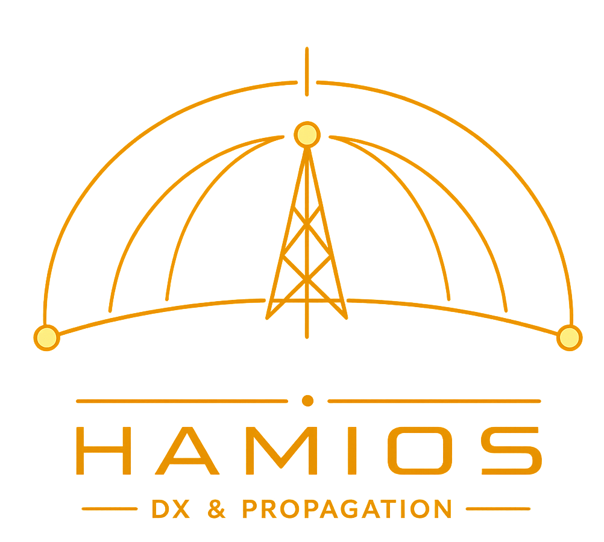

<p align="center">
  
</p>

# HF Voortplanting & Atmosfeer Monitor

**Real-time HF-voortplanting en DX-monitor voor radioamateurs — Windows 10/11**

> v5.7 · September 2026 · Frank van Dijke · *Ontwikkeld met Claude AI (Anthropic)*

[](https://hamios.space)
[](https://github.com/fvdijke/HAMIOS/releases/latest)
[](https://github.com/fvdijke/HAMIOS/releases/latest)
[](https://www.python.org)
[](https://github.com/fvdijke/HAMIOS)

---

## Overzicht

HF Voortplanting & Atmosfeer Monitor geeft radioamateurs real-time inzicht in HF-voortplantingscondities, zonne-activiteit, DX-cluster-activiteit, korte-golfschema's, satelliettracking, bliksemdetectie en directe radiobediening — alles in een modern, volledig aanpasbare donkere GUI gebouwd met PySide6/Qt6.

**Volledig tweetalig** — schakel op elk moment tussen Engels en Nederlands via Instellingen → Over.

---

## ✨ Functies

| Categorie | Beschrijving |
|---|---|
| 💡 **Propagatie-advies** | Oordeel met onderbouwing en tot vijf aanbevelingen (band → mode + frequentie → richting → tijdvenster), bevestigd door echte WSPR-, DX-cluster- en PSKReporter-spots; gebeurtenissen (NOAA R/S/G, schokgolf, Bz, sporadic-E, meteorenzwermen), komende uren, uitleg in tooltips; klik → grootcirkelpad op de kaart en CAT-afstemming |
| 📡 **Gemeten propagatie** | Eén centraal model, gekalibreerd op de dichtstbijzijnde ionosonde (KC2G/GIRO) en NOAA D-RAP-absorptie, met dode zone; dag/nacht volgens de echte zon op je QTH |
| 📶 **Banden nu** | Kans per band (160m–6m) op dit moment, dag/nacht-oordeel en trend, MUF/LUF, klik om af te stemmen via CAT |
| 🗓 **Komende 24 uur** | Rollende bandheatmap vanaf nu met de MUF/LUF-curve op dezelfde tijdas |
| 📡 **Ionosondes** | Gemeten ionosfeer rond je QTH: foF2 → hoogste NVIS-band, MUF(3000) → hoogste DX-band, gemeten t.o.v. model, 12 dichtstbijzijnde stations |
| 🛰 **Satellietovergangen** | Overkomsten van je gevolgde satellieten voor de komende 24 uur (opkomst, duur, max. elevatie, richting) met een melding 5 minuten vooraf |
| ☀ **Zon / Ionosfeer** | SFI, SSN, K/A-index, röntgenklasse, realtime zonnewind (snelheid, dichtheid, Bz) |
| 🌩 **Stormprognose** | NOAA 3-daagse kans op geomagnetische storm (G1–G4+) en de 27-daagse vooruitblik |
| 📈 **Grafieken** | Kp 48 u, Bz 24 u, GOES-röntgen 24 u, zonne- en bandhistorie (24u/7d/30d/1j) |
| 🛰 **WSPR Live** | Echte WSPR-spots rond je QTH via wspr.live (→ jouw regio elders gehoord, ← verre stations gehoord in jouw regio) |
| 📡 **Live DX Spots** | DX-cluster, band-/continentfilter, heatmap, klik om af te stemmen |
| 📡 **PSKReporter** | FT8/FT4-ontvangstrapporten als paden op de kaart |
| 🌍 **Wereldkaart** | 4096×2048 kaart met overlays (zie hieronder) |
| 🪟 **Getegelde indeling** | Panelen sluiten altijd op elkaar aan; vier indelingen (Kaart centraal, Operating, Analyse, Standaard), verslepen om te herschikken, indeling vastzetten |
| ⚡ **Bliksem** | Live Blitzortung.org-feed, QRN-advies, nabijheidswaarschuwing |
| 🔔 **Meldingen** | Zon-, propagatie-, weer- en satellietmeldingen |
| 📻 **EIBI / FT8 / SpyStations** | Kortegolfschema, naslag digitale modes, nummerstations — alle met CAT-afstemming |
| 📟 **CAT-interface** | Yaesu, Kenwood/Elecraft, Icom CI-V — live frequentie in de header |
| 📐 **HAM Antenna Designer** | Meegeleverde antennecalculator, volgt de taal van HAMIOS |
| 💾 **Profielen** | Volledige werkruimten opslaan (instellingen + indeling + venstergeometrie) |
| 🌐 **Tweetalig** | Engels / Nederlands, omschakelen via Instellingen → Over |

---

## 🗺️ Kaart Overlays

Aan/uit via de **🗺 Overlays**-knop in de header:

- Dag/nacht-grens en grayline (NOAA-zonnecalculator, incl. refractie — binnen ~1°)
- **Aurora** — gemeten kans volgens NOAA OVATION, vloeiend groen → geel → rood
- **Propagatiekaart** — kans dat de gekozen band het pad van je QTH naar elk punt op aarde draagt (zelfde model als het advies, incl. dode zone)
- **HF-absorptie** — NOAA D-RAP: waar HF na een zonnevlam of protonen-event wordt geabsorbeerd
- Zon- en maanpositie met live fasepictogram en QTH-horizonindicator (▲/▼)
- Maidenhead-locatorraster — met de muis zie je de subsquares en de 6-tekens locator
- **DXCC-landcodes** — muis op een land toont alle prefixen
- Graticule (10° / 20° / 30° stap)
- Live DX-spots en **PSKReporter**-paden gekleurd per band
- Satellietposities, baanpaden, footprints
- Blikseminslagen met ripple-ringen en waarschuwingscirkels
- Grootcirkelpad vanaf je QTH (klik op de kaart of op een aanbeveling)

---

## 🚀 Installatie

### Kant-en-klaar EXE (Windows, geen Python nodig)

1. Download **[HAMIOS5.exe](https://github.com/fvdijke/HAMIOS/releases/latest)** van de nieuwste release
2. Plaats in een lege map
3. Voer uit — de wereldkaart wordt **automatisch gedownload** bij eerste start (~1–4 MB)

### Vanaf bron

```bash
git clone https://github.com/fvdijke/HAMIOS.git
cd HAMIOS
pip install PySide6
pip install pyserial websocket-client   # optioneel
python HAMIOS5.py
```

### Afhankelijkheden

| Pakket | Vereist | Doel |
|---|---|---|
| PySide6 | ✅ Ja | GUI-framework (Qt6) |
| pyserial | Optioneel | CAT-radio-interface |
| websocket-client | Optioneel | Live bliksemdetectie |

---

## ⚙️ Configuratie

Alle instellingen worden opgeslagen in `hamios_config.json` (auto-gemaakt bij eerste start) en direct toegepast zonder herstart:

- **Station** — roepnaam, QTH (lat/lon of Maidenhead), modus, vermogen, antenne
- **Kaart** — graticule-stap, Maidenhead-/overlay-lettergrootte, zon-/maanpictogramgroottes
- **Bliksem** — vervagingsduur, waarschuwingsstralen, animatieschaal, piepinstellingen
- **Meldingen** — K-index-drempel, X-flarealert, satelliet-zone ping
- **CAT** — seriële poort, radiotype-voorinstellingen (FT-950, FT-817, TS-590, K3…)
- **Layout** — benoemde profielen opslaan/laden, snapraster

---

## 📟 CAT-radiobediening

Configureer via **⚙ Instellingen → CAT**. Ondersteunt:

- **Yaesu FT-950 / 2000 / DX-serie** — 8-cijferige FA-opdracht, standaard 38400 baud
- **Yaesu FT-817 / 857 / 897** — FA-opdracht
- **Kenwood / Elecraft** — 11-cijferige FA-opdracht
- **Icom CI-V** — binair BCD-protocol

Live frequentie weergegeven in de headerbalk. Klik op elke frequentie in het DX-, EIBI-, FT8- of SpyStations-paneel om direct af te stemmen.

---

## 🛰️ Satelliettracking

- TLE-gegevens van SatNOGS DB en AMSAT (Amateur, ISS, Weer, CubeSat), met bescherming tegen downloadblokkades en een waarschuwing bij verouderde data
- Baanmodel: Kepler + J2-storing — binnen ~10 km van SGP4 over een dag
- Realtime positie, instelbare baanpaden terug/vooruit, footprint
- **Paneel Satellietovergangen** — komende 24 uur: opkomst, aftelling, duur, max. elevatie, richting
- **Overkomstmelding** — 5 minuten vóór een overkomst (aan/uit en minimale elevatie in Instellingen → Meldingen)
- **Zone-ping** — toon wanneer een satelliet boven je horizon komt / eronder zakt

---

## ⚡ Bliksem / QRN

- Live WebSocket-feed van Blitzortung.org
- Geanimeerde ripple-ringen: centraal flits + 2 uitvouwende ringen (wit → geel → oranje)
- QRN-niveau op basis van inslagen binnen 2000 km van QTH
- Aanpasbare animatieschaal in **Instellingen → Bliksem**
- Headeralert + akoestische tik wanneer onweersbuien binnen drempel afstand liggen

---

## 📁 Bestandsstructuur

```
HAMIOS/
├── HAMIOS5.py              ← Ingangspunt
├── HAMIOS5.spec            ← PyInstaller build spec
├── hamios.ico
│
└── hamios5/                ← Python-pakket
    ├── mainwindow.py       ← Hoofdvenster + paneellay-out
    ├── mapview.py          ← Hardware-versnelde kaart (4096×2048)
    ├── layers.py           ← Bliksem-/satelliet-/DX-overlaylagen
    ├── panels5.py          ← Alle zwevende paneelwidgets
    ├── charts.py           ← NOAA data manager + grafiekwidgets
    ├── config.py           ← AppConfig dataclass (JSON-persistentie)
    ├── cat_interface.py    ← CAT-serieel-protocolimplementatie
    ├── cat_monitor.py      ← CAT-terminalvenster
    ├── settings_dialog.py  ← Instellingendialoog
    ├── sat_dialog.py       ← Satelliettrackingdialoog
    ├── spy_dialog.py       ← SpyStations-dialoog
    ├── eibi_dialog.py      ← EIBI korte-golfbrowser
    ├── ft8_dialog.py       ← FT8/digital frequentiereferentie
    ├── help_dialog.py      ← Doorzoekbare hulp
    └── theme.py            ← Donker themaconstanten
```

Automatisch gemaakte runtime-bestanden (niet in repository):

| Bestand | Beschrijving |
|---|---|
| `hamios_config.json` | Alle instellingen, paneelposities, CAT-config |
| `worldmap_eq.jpg` | Standaard resolutiekaart (automatisch gedownload) |
| `worldmap_eq_hires.jpg` | 4K-wereldkaart (automatisch gedownload) |
| `hamios_tle.json` | Satelliet TLE-gegevens (vernieuwd van CelesTrak) |
| `hamios_profiles.json` | Opgeslagen profielen (complete workspaces) |
| `HAMIOS_history.csv` | 90-daagse bandbetrouwbaarheidsgeschiedenis |

---

## 🙏 Gegevensbronnen

| Bron | Gegevens |
|---|---|
| [NOAA SWPC](https://www.swpc.noaa.gov/) | Zonne-gegevens, K-index, Bz, X-straal, stormprognose |
| [DXWatch.com](https://dxwatch.com/) | Live DX-cluster |
| [Blitzortung.org](https://www.blitzortung.org/) | Wereldwijde bliksemdetectie (WebSocket) |
| [eibispace.de](https://www.eibispace.de/) | EIBI korte-golfschema's (Eike Bierwirth) |
| [CelesTrak](https://celestrak.org/) | Satelliet TLE-gegevens (Dr. T.S. Kelso) |
| [Wikimedia Commons](https://commons.wikimedia.org/) | NASA Blue Marble wereldkaart |

Alle verbindingen gebruiken standaard HTTPS/WebSocket. Geen persoonlijke gegevens worden verzonden.

---

## 📋 Changelog

### v5.7 — September 2026
- **Eén propagatiemodel, gekalibreerd op de echte ionosfeer**: dichtstbijzijnde ionosonde (KC2G/GIRO) en NOAA D-RAP-absorptie; dode zone op korte paden; dag/nacht volgens de echte zon op je QTH
- **Slim propagatie-advies**: aanbevelingen bevestigd door echte WSPR-, DX-cluster- en PSKReporter-spots, gebeurtenissen, komende uren, uitleg in tooltips, pad op de kaart
- **Getegelde paneelindeling**: vier indelingen (Kaart centraal, Operating, Analyse, Standaard) en indeling vastzetten
- **Nieuwe panelen**: Ionosondes (gemeten ionosfeer) en Satellietovergangen met een melding vooraf
- **Nieuwe kaartlagen**: propagatiekaart vanaf je QTH per band en NOAA D-RAP HF-absorptie; vloeiende OVATION-aurora
- **Nauwkeurigheid**: grayline en dag/nacht-grens lagen tot ~6° (≈25 min) te ver naar het oosten — nu binnen ~1°; satellietposities zaten honderden km ernaast — nu ~10 km
- **Data**: echte WSPR-spots via wspr.live, realtime zonnewind (Bz), 27-daagse vooruitblik; NOAA-data alleen downloaden als die veranderd kan zijn
- **Bediening**: vinkjes met een amberkleurige V, uitklappijltjes, resterende Nederlandse teksten vertaald, HAM Antenna Designer volgt de taal van HAMIOS

### v5.6 — September 2026
- Satelliet-TLE-data van SatNOGS en AMSAT met bescherming tegen downloadblokkades en een waarschuwing bij verouderde data
- Kaart tekent circa twee keer zo snel; mouse-over voor DXCC-prefixen en Maidenhead-squares; FT8-frequenties in MHz

### v5.5 — Juli 2026
- **Nieuwe antennetool — HAM Antenna Designer**: de ingebouwde antennecalculator is vervangen door de zelfstandige HAM Antenna Designer (📡 Antenna-knop) — 20+ gedocumenteerde antenneontwerpen (verticals, dipolen, EFHW, loops, Yagi, Moxon, quad, J-pole, SWL-ontvangstantennes), onderbouwde formules, bouwadvies, schematische tekeningen, SWR-tabel, Smith-diagram, stralingspatronen en voedingslijnverlies-vergelijking
- **TLE-caching gerepareerd**: satelliet-TLE-data wordt niet meer bij elke start opnieuw gedownload — een bestaande cache wordt nu correct herkend en alleen bij ontbreken eenmalig gedownload
- **TLE-leeftijd zichtbaar**: splash-scherm en Satellietvenster tonen nu hoe oud de gecachte TLE-data is (bijv. "34 KB · 3 d"); handmatig verversen via ↻-knop ongewijzigd
- **Snellere start**: hoofdvenster wordt niet meer twee keer opgebouwd bij ingeschakeld splash-scherm — halveert de opstarttijd en verwijdert dubbele achtergrondverbindingen (Blitzortung WebSocket, timers)
- **EiBi-taalcodes gecorrigeerd**: `SWA` (Swahili) en `SWE` (Zweeds) vertalen nu correct (voorheen dode `SW`-entries)
- **Vertaalfix**: ontbrekende Nederlandse tekst voor satelliet-cachestatus ("{n} satellieten uit cache")
- **Codekwaliteit**: grote opschoonronde — ongebruikte imports, dode code en dubbele definities verwijderd in alle modules; unittest-suite gerepareerd (39 tests groen)

### v5.4 — Juni 2026
- **Profielbeheer**: Volledige werkruimten opslaan/laden (config + paneellay-out + venstergeometrie) als benoemde profielen of standaard backup
- **MUF/LUF Prognose Panel**: 24-uur Maximaal/Minimaal Bruikbare Frequentievisualisatie met rasterlijnen, bandzonekleuren en real-time indicator
- **WSPR Live Feed**: Real-time WSPR QSO-tabel met sorteerbare kolommen (roepnaam, grid, frequentie, SNR, afstand, pad, UTC-tijd)
- **Paneel-zichtbaarheid knop**: Snelle 🪟 header-knop om paneelzichtbaarheid in/uit te schakelen zonder instellingen te openen
- **Online bron monitoring**: 9-categorie connectiviteitscontrole op splash-scherm (NOAA, CelesTrak, WSPRnet, DXWatch, PSK Reporter, Blitzortung, EIBI, Wikimedia, HamQSL)
- **Verbeterde headers**: Betere contrast en organisatie op alle panelen
- **Grafieken verbeteringen**: MUF/LUF-prognose met bandzone-achtergrondkleuring, rasterlijnen en schoon minimaal ontwerp

### v5.2 — Juni 2026
- **EIBI**: lijst nu standaard gesorteerd op kHz (numeriek); stationsnaam verplaatst naar tweede kolom
- **Satelliettracking**: aanpasbare baanpadelijnbreedte (Instellingen → Kaart)
- **Instellingen / Kaart-tabblad**: alle besturingselementen worden nu live toegepast (geen herstart nodig); labels volledig vertaald EN/NL

### v5.1 — Mei 2026
- Header-klok tijdzone automatisch afgeleid van QTH-coördinaten (via `timezonefinder`)
- Graceful fallback naar OS-systeemtijdzone als `timezonefinder` niet is geïnstalleerd
- Splash-schermcontroles: maptoegang (maken/schrijven/lezen/verwijderen) + internetconnectiviteit

### v5.0 — Mei 2026
- Volledige herschrijving naar PySide6 / Qt6
- Hardware-versnelde wereldkaart — geen PIL/Pillow-afhankelijkheid
- Kant-en-klaar EXE — geen Python-installatie vereist

---

## 🤝 Bijdragen

Issues en pull requests zijn welkom. Zie [CONTRIBUTING.md](CONTRIBUTING.md).

---

*© 2026 Frank van Dijke · Open-source radioamateur-software*
*Ontwikkeld met [Claude AI](https://claude.ai) (Anthropic) · PySide6 · Python 3.10+*
